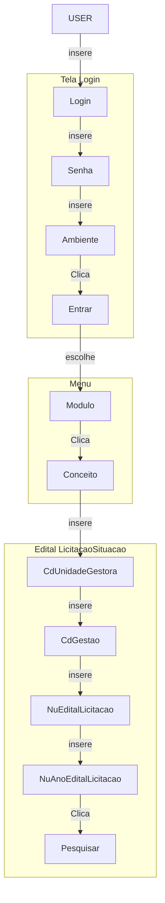

# **⟳** FTCapp ▶

> ​               friendly test case app


##INDICE

[TOC]


> A parte técnica não é o objetivo desse documento

## Pré requisitos
- Apresentar interface de usúario Amigável e ergonômica.
- Criar casos e suítes de testes automatizados e dinâmicos.
  - Casos que incluam uma ou mais funcionalidades
  - Troca de telas
  - Consultas no proprio sistema
- Armazenar casos de testes.
- Rodar casos de testes.
- Armazenar suítes de testes.
- Rodar suítes de testes.
- Operável por usuário que tenha conhecimento de negocio e do sistema.
  - Foi planejado para que partes das equipes de qualidade e testes pudessem operar o app sem o conhecimento de linguagem de programação


## Para que serve?
- Cobertura de regras de negocios.
- Evidencia de Erro.
  - É possivel passar um caso de testes para um colega te trabalho
- Auxilia em manter a integridade do sistema após alterações de funcionalidades.
  - Como os casos de testes ficam armazenados, é possível usar um caso de testes anterior a uma alteração para garantir que não houve impacto.


## Ações Automatizadas

- Acessar as telas do sistema.
- Se logar 
- Navegar
- Preencher campos
- Interagir com o DOM
- Recolher informações
- Acessar banco de dados do sistema afim de trazer informações de negocio uteis para o teste.
  - Enquanto o caso de testes esta rodando é possível recolher informações do bando de dados configuraveis pelo usuário e que interagem com os elementos da tela atual
    - Por exeplo se estamos consultando uma Unidade Gestora, é possível recolher o CDUNIDADEGESTORA (ou qualquer outro elemento do contexto) e inserir em um SCRIP SQL dinâmicamente.

## Ações do usuário Não tecnico

- Inserir login e senha
- Inserir dados de conexão com o banco de dados
- Inserir Tranzações/Conceitos ao qual deseja criar o caso de testes
- organizar os elementos na ordem que deseja que o teste seja executado

## Ações do usuário tecnico

- Inserir consultas Scripts SQL que podem interagir com o caso de testes  e podem usar elementos que estão presentes no contexto

--------------------------------


## Exemplo de Uso

> Abaixo segue um exemplo de teste simples para apresentar as funcionalidades do FTCapp


###Montar cenário de teste###

#### Definir Módulo, Conceito, Funcionalidade, Elementos e Eventos

- **Módulo** 
  - CTR
- **Conceito**
  - Edital Licitação Situação
- **Funcionalidade** 
  - Pesquisar
- **Elementos**
  - txtCdUnidadeGestora
  - txtCdGestao
  - txtNuEditalLicitacao
  - txtNuAnoEditalLicitacao
  - btnPesquisar


- **Valores**
  - txtCdUnidadeGestora = 270002
  - txtCdGestao = 1
  - txtNuEditalLicitacao = 1
  - txtNuAnoEditalLicitacao = 2018
- **Eventos**
  - btnPesquisar = Click


#### Definir sequencia





Esse é um exemplo de caso de uso simples agora imagine um cenário onde é necessário mais conplexo envolvendo varios formulários e conceitos. Cada vez que se deseja testar ou mesmo montar um cenário para um teste acaba gerando esforço repetitivo e muitas vezes o fluxo de interação não esta bem claro pro profissional que precisa chegar a um determinado estado do sistema para poder desenvolver uma evolutiva, corrigir um erro ou mesmo testar uma funcionalidade. Por isso vamos ver como fazer isso de forma automatizada cadastrando apenas uma vez todo o caso de testes.

### Cadastrar Caso de Teste no FTCapp

#### Inserir Cenário

A primeira coisa a fazer é inserir os dados do conceito para que o FTCapp recolha os elementos do mesmo. No Painel de Consulta basta preencher os campos

##### Cliente

- Salvador
- SC
- RN

#####Ambiente

- DSV
- HOM
- PRD

#####Conceito

- Alterar Edital Licitacao

#####Login

- Login do usuario no SIGEF

#####Senha

- Senha do usuario no SIGEF

No Painél  

1. Insira os dados.

.

2. Clique em Buscar Elementos 
3. O FTCapp vai se logar, acessar a tela e recolher todos elementos relevantes presentes.
   - CTRAlterarEditalLicitacaoSituacao  (*Tela*)
   - CDUNIDADEGESTORA
   - CDGESTAO
   - EDITALLICITACAO
   - ANOEDITALLICITACAO
   - SITUACAOATUAL
   - DTSITUACAOATUAL
   - DTPUBLICACAODO
   - DTREPUBLICACAOPUBLICACAODO
   - OBSERVACAO
   - NOVASITUACAO
   - DTNOVASITUACAO
   - NUMERODO
   - NUMERODOREPUBLICADO
   - MSG (*Mensagem ERRO*)
4. No Backend o FTCapp guarda todas essas informações 
   - Elemento txtNuAnoEditalLicitacao

```html
<input 
	   name="txtNuAnoEditalLicitacao"
	   type="text" 
	   maxlength="4" 
	   id="txtNuAnoEditalLicitacao"
	   class="SIGEFTextbox" 
	   onmouseout="window.status=' '"
	   onKeyUp="AutoTabular(this,4,event);"
	   onpaste="javascript: return false;" 
	   oncontextmenu="javascript: return false;" onBlur="javascript: return FormatarValorNumerico(this, event, '9999');" onFocus="javascript:RemoverZerosEsquerda(this, event, '9999');" 
	   ondragenter="javascript: return false;"
	   onKeyPress="javascript: return ValidarDigito(this, event, '9999');" onmouseover="window.status='Informe o Ano do Edital Licitação';return true" style="width:45px;text-align:right;"
	   />
```

- Informações do conceito 

.

```javascript
{
  "Conceito": "CTRAlterarEditalLicitacaoSituacao",
  "Elementos": {
    "CDUNIDADEGESTORA": {
      "ID": "txtCdUnidadeGestora",
      "TIPO": "text"
    },
    "CDGESTAO": {
      "ID": "txtCdGestão",
      "TIPO": "Text"
    },
    "DTSITUACAOATUAL": {
      "ID": "txtDtSituacaoAtual",
      "TIPO": "date"
    },
    "DTPUBLICACAODO": {
      "ID": "txtdtPublicacaoDO",
      "TIPO": "date"
    },
    "PESQUISAR": {
      "ID": "btnPesquisar",
      "TIPO": "Buttom"
    },
    "NOVASITUACAO": {
      "ID": "CdNovaSitucao",
      "TIPO": "select"
    }
  }
}
```

4. Traz Todos os Elementos para o Fluxo de Teste

   ​

   

####Montar Cenário

O Paniel Fluxo de teste é composto por dois subPaineis **ELEMENTOS** e **CASO DE TESTE**

Todos os elementos que foram recolhidos da tela ficam dispostos a Esquera no sub Painel ELEMENTOS

Para montar o fluxo de caso de teste visto visto acima.

#####Escolher elementos

1. Clique sobre o elemento 
2. Arraste ate o painel Direito CASO TESTES 

##### Inserir Valores nos elementos


Arraste os elementos na sequencia que deseja que o teste seja realizado


1.5 Carregar Grid de Elementos

Poderiamos já inserir os valores que queremos preencher e já rodar o teste, porém não seria tão eficaz. Por que eu teria apenas um valor para cada elemento.  Para rodar o mesmo caso de teste com varios valores para cada elemento basta 

#####clicar em **.**

Isso nos Leva para o painel **GRID ELEMENTOS**


####1.6 Rodar o Caso de Teste

A **GRID ELEMENTOS** se monta automaticamento com os elementos que estão no Painel **CASO TESTE**

Você pode preencher os valores que deseja e 

#####Clicar em ****.


O FTC 

1. ######Faz o login:


2. ######Acessa a tela:


3. ######Preenche os campos com os valores da GRID ELEMENTOS


4. ######Clica em Pesquisar:


5. Fecha o broswer ou mantem aberto dependendo da configuracão que o usuário optou 

####1.7 Inserir mais valores para o mesmo caso de testes

Cada Linha da **GRID ELEMENTOS** possui um botão  que serve para adicionar uma nova linha logo abaixo.


Observe que a nova linha é adicionada com os mesmos valores da linha anterior. Agora basta alterar os valores que quiser


E clicar no botão 

Agora em vez de rodar uma vez vai rodar duas e se deixar a opção  desmarcada o broswer permanece aberto em cada vez. Assim que fechar roda a próxima linha.


####Recapitulando:

Até aqui vimos a possibilidade de guardar casos de testes e montar cenários. 

- #####Prenchimento dos campos "transação", "usuário" e "senha" no painel **CONSULTA CASO DE TESTE**


- #####O sistema traz todos os elementos da tela ELEMENTOS INTERACAO


- #####O usuário adiciona os elementos que vai usar **CASO USO**


- #####A Grid se monta dinamicamente de acordo com os elementos escolhidos **GRID ELEMENTOS**


- #####O Usuário Preenche com os dados que deseja e roda o teste.


O FTC executa o que foi programado na tela do conceito

 

#####Diagrama 


```mermaid

```

###Passo a Passo Parte 2 - Validar Elementos

Continuando o passo a passo agora vamos criar as validações.

Exemplo:

Quero que teste se o campo  tem um valor igual a 2.

Como já sabemos que ele tem esse teste deve passar

Quando consultamos uma transação no inicio do passo a passo, além de carregar o Painel **ELEMENTOS INTERACAO** o FTC também carrega o Painél **ELEMENTOS VALIDACAO**


Para gerar uma validação temos que incluir o elemento validação referente.


Clicar no botão 

Ele vai para o Painél **CASO TESTE**


O Elemento Validação  quando esta no Painel **CASO TESTE** tem um desenho diferente. Ele posue dois combobox.  

O primeiro define a validação 

Com as opções

.

O segundo combobox afirma ou nega o primeiro. Com as opções

.

####Validação de afirmação

Exemplos: 

Quero verificar se o  é igual a 2

Basta selecionar a opção  no primeiro combobox e  no segundo.

Vai ficar assim

.

Na verdade a gente já sabe que é 

Basta clicar em  A Grid vai ser montada dinâmicamente 


Reparem que na GRID foi incluida a coluna NUMERODO:SIM IGUAL

.

####Inserir Valores de Validação

Basta incluir os valores 

e rodar  o Caso de teste.

O resultado pode ser observado no Painel **CASO TESTE**

.

####Validar um elemento mais de uma vez

Um elemento de validação possui o botão duplicar 

Se quisermos fazer mais de uma validação com o mesmo elemento basta clicar em 

Esse é o resultado


Reparem que agora temos dois elementos para o mesmo campo NUMERODO[1] e NUMERODO[2]


Essa vai ser a referencia de cada um deles na **GRID ELEMENTOS**

Vamos testar agora se o  é diferente de 2 e se ele é Somente Leitura

Para isso no elemento validação NUMERODO[1] vamos selecionar na primeira compobox a opção  e o segundo combobox a opção 

####Validação de negação

Quando selecionados a opção  do primeiro combobox significa que ele esta negando a primeira opção. 

Ou seja no caso da combinação dos combobox ficar IGUAL e NAO  isso significa que queremos saber se o valor inserido na GRID ELEMENTOS para ele é diferente do valor que estara no conceito , que nesse caso é igual a 2.  


O Elemento validação NUMERODO[1] vai ficar assim

.

Vamos configurar o elemento validação NUMERODO[2] para que esteja somente leitura.  O primeiro combobox  e o segundo .

Vai ficar assim .


O Painel CASO TESTE vai ficar assim:

.

Clicando em 

.

Agora temos duas referencias ao NUMERODO na grid,  Como Somente leitura não precisa inserir valor não tem a opão de editar. 

Basta preencher os valores 


e .

O resultado no Painél CASO TESTE


####Retorno do Caso de Teste

#####Retorno negativo

Caso a Validação não seja um sucesso o elemento validação que "não passou" fica em Vermelho no Painel **CASO TESTE** 

#####Retorno positivo

Como vimos acima quando a validação tem um retorno posivo o elemento validação fica com a cor verde.

.


Agora vamos fazer uma serie de validações

####Validações Variáveis

Vamos fazer as seguintes validações

 é maior de 3 ?

 esta contido nessa lista  3,4,1,2,8 ?

 contem esses caracteres "Edição"?

. esta contido nessa lista "Em Edição, Publicado"

. esta Visível ?

. é maior que hoje?	

 é igual a 

 esta entre esses numeros 4,8?

 esta entre hoje e hoje mais 30 dias?

 esta entre hoje e hoje menos 1ano?

###Passo a Passo Parte 3 - Consulta dinamica com SQL

####Criar SQL para trazer os dados de interação

###Passo a Passo Parte 4 - Validações Dinamicas com SQL

####Inserir um sql em um elemento Validação

###Passo a Passo Parte 5 - Reutilizar Casos de testes Compartilhados

####Buscar Casos de Teste por Transação

####Buscar Casos de Teste po Nome

```mermaid
graph TD
USER
subgraph CONSULTA CASO DE TESTE 
A[Informa dados transação]
CARREGAR((CARREGAR))
end
subgraph ELEMENTOS INTERACAO
B[Escolhe os elementos]
ADD
end
subgraph CASO TESTE
CARREGAR_GRID((CARREGAR_GRID))
end
subgraph GRID ELEMENTOS
C[Insere os valores dos elementos]
RODAR((RODAR))
end
subgraph TELA CONCEITO
D[Permanece aberta]
end
    USER-->A
    A-->CARREGAR
    CARREGAR-->B
    B-->ADD
    ADD-->CARREGAR_GRID
    CARREGAR_GRID-->C
    C-->RODAR
    RODAR-->D
classDef green fill:#9f6,stroke:#333,stroke-width:2px;
    class RODAR green
```

