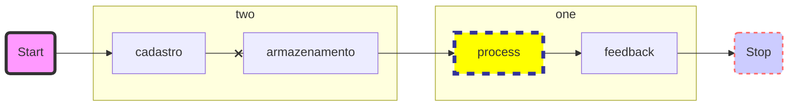
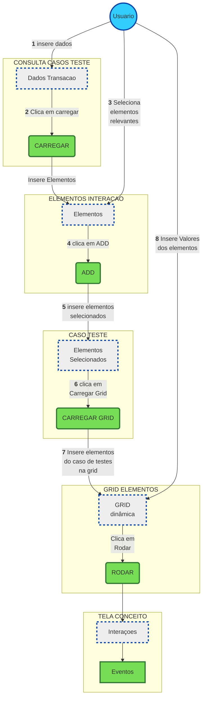

```mermaid
graph LR
    id1(Start)
    id2(Stop)
    a1[process]
    b1[cadastro]
    b2[armazenamento]
    a2[feedback]
    style id1 fill:#f9f,stroke:#333,stroke-width:4px
    style id2 fill:#ccf,stroke:#f66,stroke-width:2px,stroke-dasharray: 5, 5
    style a1 fill:#ff0,stroke:#339,stroke-width:5px,stroke-dasharray:10
id1-->b1
a2-->id2
b2-->a1
    subgraph one
    a1-->a2
    end
    subgraph two
    b1--xb2
    end
```


​    


```mermaid
graph TD
u((Usuario))

c(CARREGAR) 
r(RODAR)
ad(ADD)
cg(CARREGAR GRID)

g[GRID </br> dinâmica]
e2[Elementos </br>Selecionados]
e[Elementos]

dt[Dados Transacao]

it[Interaçoes]
ev[Eventos]

style r fill:#7d5,stroke:#373,stroke-width:3px;
style ad fill:#7d5,stroke:#373,stroke-width:3px;
style c fill:#7d5,stroke:#373,stroke-width:3px;
style cg fill:#7d5,stroke:#373,stroke-width:3px;
style ev fill:#7d5,stroke:#373,stroke-width:3px;

style u fill:#3cf,stroke:#04a,stroke-width:3px; 

style e fill:#eee,stroke:#04a,stroke-width:3px,stroke-dasharray: 5, 5;
style e2 fill:#eee,stroke:#04a,stroke-width:3px,stroke-dasharray: 5, 5;
style g fill:#eee,stroke:#04a,stroke-width:3px,stroke-dasharray: 5, 5;
style dt fill:#eee,stroke:#04a,stroke-width:3px,stroke-dasharray: 5, 5;
style it fill:#eee,stroke:#04a,stroke-width:3px,stroke-dasharray: 5, 5;


subgraph CONSULTA CASOS TESTE 
dt
c
end
subgraph ELEMENTOS INTERACAO
e
ad
end
subgraph CASO TESTE
e2
cg
end
subgraph GRID ELEMENTOS
g
r
end
subgraph TELA CONCEITO
it
ev
end
    u-->| <b>1</b> insere dados|dt

    dt-->|<b>2 </b>Clica em carregar|c

    c-->|Insere Elementos|e

    u-->|<b>3 </b>Seleciona</br>elementos</br>relevantes|e

    e-->|<b>4</b> clica em ADD|ad

ad-->|<b>5</b> insere elementos </br>selecionados|e2

e2-->|<b>6</b> clica em </br>Carregar Grid|cg

cg-->|<b>7</b> Insere  elementos</br>do caso de testes</br>na grid |g

u-->|<b>8</b> Insere Valores </br>dos elementos|g


g-->|Clica em </br> Rodar|r

r-->it
it-->ev

```


```mermaid

```